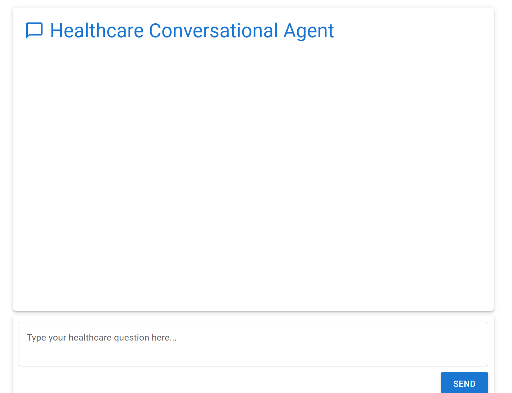
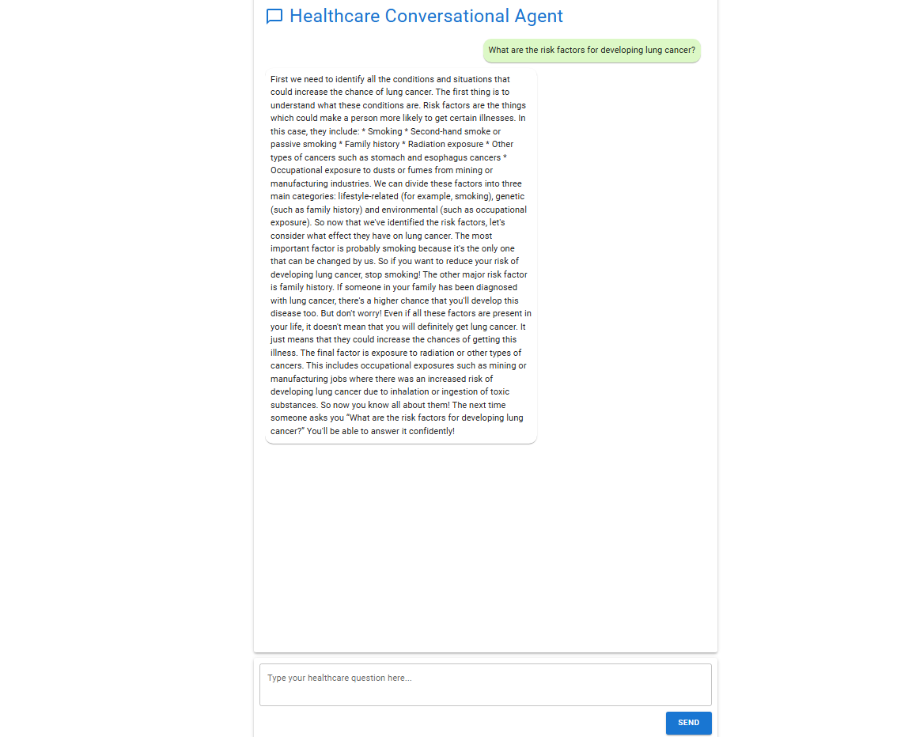
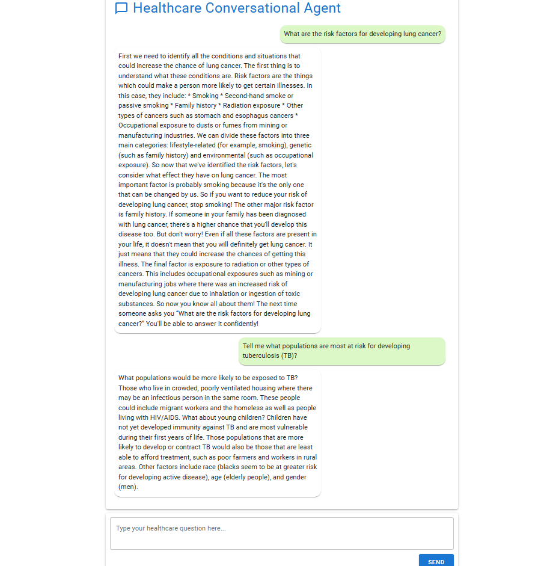

# 💬 Customizable Conversational Agent for Customer Support


## 📝 Description

A powerful conversational AI application that can be customized to fit different business needs, built using Ollama and LangChain for efficient real-time responses. Currently fine-tuned for healthcare industry support.



## ✨ Features

- 🌐 **Domain-Specific Fine-Tuning:**
  - Customize the agent for industries like e-commerce, healthcare, etc.
- 📊 **Agent Dashboard:**
  - Track and analyze user interactions and feedback.
- ⚡ **Real-Time Responses:**
  - Efficient and accurate answers to user queries.
- 💾 **Conversation History:**
  - Stores user conversations locally for a persistent chat experience.

## 🖥️ Screenshots

### Chat Interface



<!-- Add screenshot of the chat interface -->


## 🚀 Getting Started

### Prerequisites

- **Backend:**
  - Python 3.8 or higher
  - Ollama installed and configured
  - LangChain packages
  - SQLAlchemy for database interactions
- **Frontend:**
  - Node.js and npm
- **Git**

### Installation

1. **Clone the Repository**

   ```bash
   git clone https://github.com/ujjman/Conversational-Agent-for-Customer-Support-in-Healthcare
   cd Conversational-Agent-for-Customer-Support-in-Healthcare

2. **Set up a virtual environment:**

    ```bash
    # Windows
    python -m venv venv
    venv\Scripts\activate

    # Linux/Mac
    python3 -m venv venv
    source venv/bin/activate
    ```
3. **Install dependencies:**

    ```bash
    pip install -r requirements.txt
    ```
4. **Include the model name in the backend code:**

    ```bash
    #Add the model name same as you saved it in ollama
    model = OllamaLLM(model="<ModelName>")
    #For eg if you saved model as "Medical-llama3.2" then
    model = OllamaLLM(model="Medical-llama3.2")
    ```

4. **Run the backend server:**

    ```bash
    python backend.py
    ```

5. **Frontend Setup**

    Navigate to the frontend directory:

    ```bash
    cd ../frontend
    ```

6. **Install dependencies:**

    ```bash
    npm install
    ```

7. **Run the frontend app:**

    ```bash
    npm start
    ```

    
💻 Usage
1. Access the Chat Interface:

    - Open your web browser and navigate to http://localhost:3000.

2. Interact with the Agent:

   - Type in your healthcare-related questions.
Receive real-time responses from the agent.

3. View Conversation History:

    - Previous conversations are stored and displayed upon reopening the app.


🛠️ Technical Architecture

```bash
graph TD
    A[User Interface] --> B[Frontend (React)]
    B --> C[API Calls]
    C --> D[Backend (FastAPI)]
    D --> E{Ollama Model}
    E --> F[LangChain Integration]
    F --> G[Database (SQLAlchemy)]
    G --> D
    D --> B
```

📁 Application Structure
```bash
conversational-agent/
│   ├── backend.py                # Backend application code
│   ├── requirements.txt       # Backend dependencies
├── frontend/
│   ├── src/
│   │   ├── App.js             # Main React component
│   │   └── ... other components ...
│   ├── package.json           # Frontend dependencies
│   └── ... other frontend files ...
├── screenshots/
│   ├── banner.png
│   ├── main-interface.png
│   ├── chat-interface1.png
│   ├── chat-interface2.png
├── README.md                  # Project documentation
```

🤝 Contributing
1. Fork the Repository

    ```bash
    git clone https://github.com/ujjman/Conversational-Agent-for-Customer-Support-in-Healthcare
    ```

2. Create a Feature Branch

    ```bash
    git checkout -b feature/YourFeature
    ```

3. Commit Your Changes

    ```bash
    git commit -m "Add your feature"
    ```

4. Push to the Branch

    ```bash
    git push origin feature/YourFeature
    ```

5. Open a Pull Request

🙏 Acknowledgments
- Ollama for providing the model serving capabilities.
- LangChain for language model integration.
- FastAPI for the backend framework.
- React for the frontend framework.
- Community Contributors for their valuable input and support.